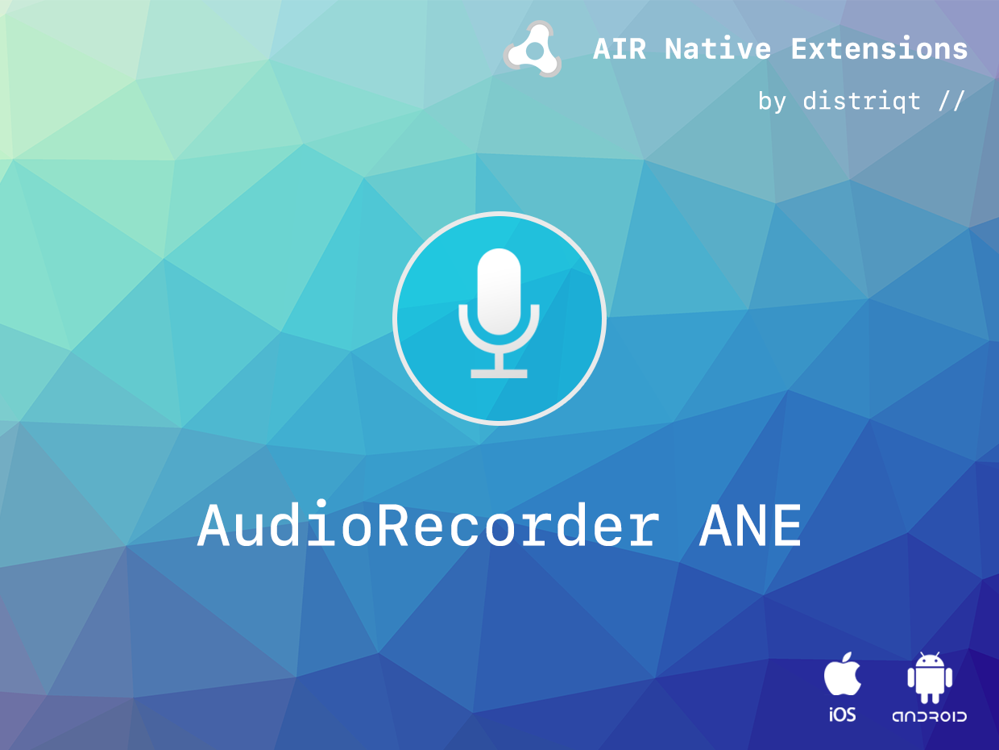
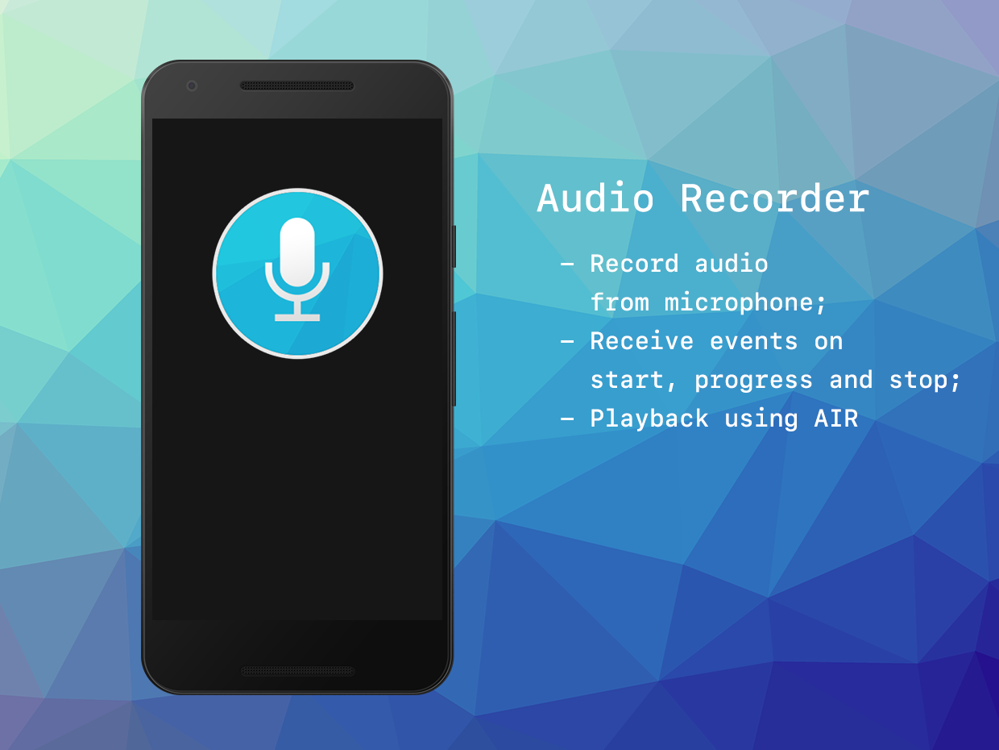

built by [distriqt //](https://airnativeextensions.com) 



# AudioRecorder

AudioRecorder is an AIR Native Extension to record audio from the user's microphone to a file.

The simple API allows you to quickly integrate audio recording in your AIR application in just a few lines of code.

### Features

- Record from the device microphone to a native format
- Start, progress and end events
- Single API interface - your code works across supported platforms with no modifications
- Sample project code and ASDocs reference


## Documentation

Latest documentation can be found in the [wiki](https://github.com/distriqt/ANE-AudioRecorder/wiki)

Quick Example: 

```actionscript
var file:File = File.applicationStorageDirectory.resolvePath( "recording.m4a" );

var options:AudioRecorderOptions = new AudioRecorderOptions();
options.filename = file.nativePath;
options.audioEncoding = AudioEncoder.AAC;

AudioRecorder.service.start( options );
```

More information here: 

[com.distriqt.AudioRecorder](https://airnativeextensions.com/extension/com.distriqt.AudioRecorder)


## License

You can purchase a license for using this extension:

[airnativeextensions.com](https://airnativeextensions.com/)

distriqt retains all copyright.





