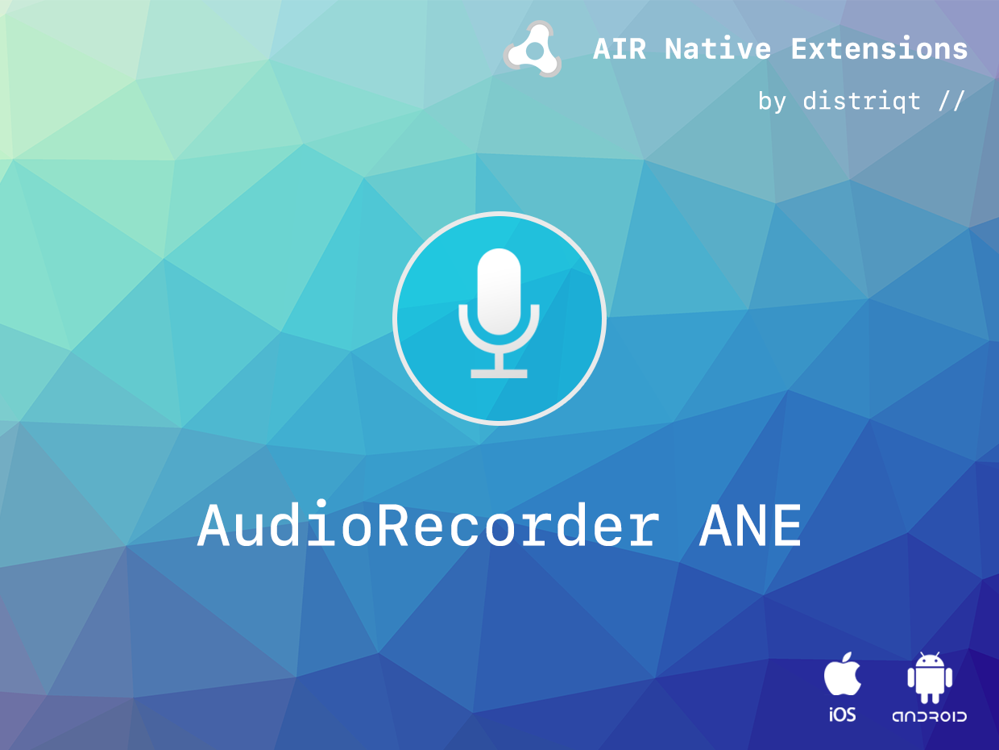

# Audio Recorder

AudioRecorder is an AIR Native Extension to record audio from the user's microphone to a file.

The simple API allows you to quickly integrate audio recording in your AIR application in just a few lines of code.

### Features

- Record from the device microphone to a native format
- Start, progress and end events
- Single API interface - your code works across supported platforms with no modifications
- Sample project code and ASDocs reference

This Wiki forms the best source of detailed documentation for the extension along with 
the [asdocs](https://distriqt.github.io/ANE-AudioRecorder/asdocs). 

